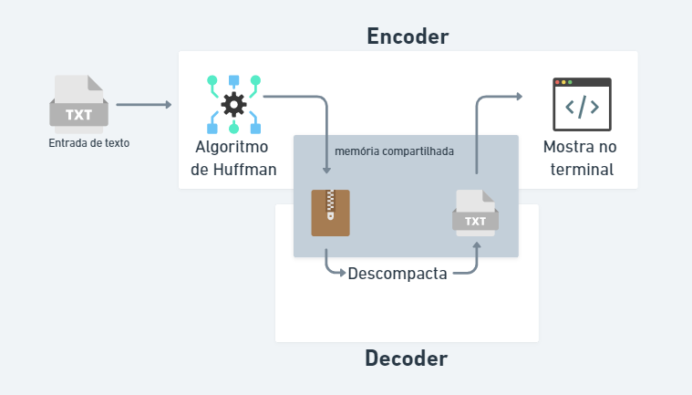
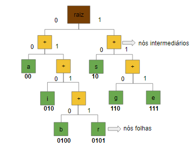
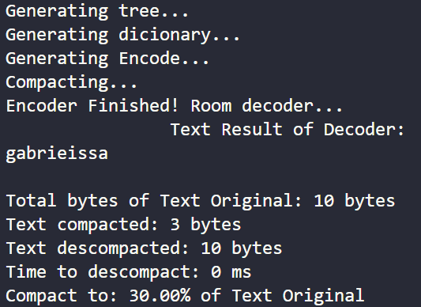

<div align="center">

Project development for <a href="https://www.42sp.org.br/">  </a>


# 42Labs - Compactador de Arquivos.



Este projeto consiste em fazer um compactador e um descompactador de argumento passado, utilizando o algoritmo de Huffman e compartilhamento de memória. Para isso utilizaremos dois programas,que devem se chamar: encoder e decoder. O encoder ficará responsável pela compactação do argumento passado e imprimir os resultados da descompressão na tela. Enquanto o decoder ficará responsável por descompactar o texto comprimido. Isso só é possível, pois utiliza-se o compartilhamento de memória entre programas, ou seja, tanto o encoder quanto o decoder terão acesso à mesma memória.

``Contextualização Histórica:``

O compactador de arquivos foi uma solução criativa e eficiente, numa época em que não se havia muito espaço nos discos rígidos e comprá-los era caro. 

Há algumas maneiras famosas de se compactar arquivos, como o winRAR, com o algoritmo de Lempel-Ziv-Welch, que baseia-se em criar um dicionário, onde ficam armazenadas as informações codificadas e área de pesquisa(contendo a string responsável por comprimir e descomprimir o arquivo). 

No entanto neste projeto, não pode usar o algoritmo LZV, mas sim o algoritmo de Huffman.

``Algoritmo de Huffman:``


O algoritmo de Huffman, baseia-se em 5 passos:

1º passo: calcular uma tabela de frequência, dos caracteres que aparecem nos argumentos passados:
```bash
$> ./bin/encoder gabrieissa

Nota-se que "gabrieissa" tem 10 caracteres.

╔══════════════╦═══════════════╗
║   Caractere  ║  Frequência   ║
╠══════════════╬═══════════════║
║      1       ║      b        ║
║      1       ║      e        ║
║      1       ║      g        ║
║      1       ║      r        ║
║      2       ║      a        ║
║      2       ║      i        ║
║      2       ║      s        ║
╚══════════════╩═══════════════╝
```

2º passo: Utiliza-se a frequência de cada caractere para montar a árvore binária:



A árvore binária é uma estrutura de dados que consiste em decisões bidirecionais(direita, ou esquerda). 

O primeiro nó da lista, chama-se de raiz(ou pai) e a partir deste nó coloca-se dois nós intermediários (ou filhos) um para esquerda e outro para direita. Os últimos elementos da árvore(que não possuem filho), são chamados de nós folhas.

Para construir a árvore pega-se os dois caracteres menos frequentes e coloca-se como as folhas, unindo-os por um nó intermediário. A frequência destes dois nós somadas é utilizada para a reinserção deste nó pai na lista novamente. Repete-se este processo até sobrar o nó raiz que será a soma de todos os caracteres utilizado na árvore.

3º passo: Faz-se codificação de cada caractere dos argumentos passados, percorrendo toda a árvore e atribuindo um novo valor para cada caractere.

Com isso gerará o que chama-se de dicionário. Para preencher o dicionário, utiliza-se, a ideia de que toda vez que for para direita conta-se 1, e toda vez que for para a esquerda conta-se 0, importante ressaltar que o lado prioritário para ir ao filho é o ESQUERDO, quando não tiver mais esquerdo, ou o esquerdo já foi codificado, ele irá para o lado direito e toda vez que chegar à uma folha(sem filho), ele volta para a raiz. 

Vale ressaltar que os caracteres mais frequentes ficarão acima na árvore, e assim terão uma sequência codificada consideravelmente menor do que os menos frequentes.

```
╔══════════════╦═══════════════╗
║   Caractere  ║  Dicionário   ║
╠══════════════╬═══════════════║
║      b       ║     0100      ║
║      e       ║     111       ║
║      g       ║     110       ║
║      r       ║     0101      ║
║      a       ║     00        ║
║      i       ║     010       ║
║      s       ║     10        ║
╚══════════════╩═══════════════╝
```

4º passo: Após ser criado o dicionário, faz-se a compactação dos argumentos passados. Na compactação cada caractere do argumento original, é trocado pelo seu novo valor do dicionário.
Para fazer esta troca usa-se a manipulação de bits, sabe-se que um caractere ocupa 1 byte, ou 8 bits. O bit só pode ser 0 ou 1, então o argumento passado será preenchido apenas por 0 e 1.

Argumento original:
```
01100111011000010110001001110010011010010110010101101001011100110111001101100001
```

Argumento compactado:
```
110000100010111010101000
```

O argumento original tem 80 bits, enquanto o compactado tem 24 bits. Nisso economizou-se 56 bits.

5º passo: Com os argumentos já compactados, eles serão enviados para o programa Decoder através de compartilhamento de memória. O programa recebe a árvore e o argumento passado compactado para fazer a descompactação, caso haja alguma diferença entre o argumento passado originalmente e o descompactado, quer dizer que houve algum erro na execução do programa.

No fim de todas as etapas o programa encoder vai imprimir alguns dados solicitados na tela, que são:



``Memória Compartilhada:``

A memória compartilhada é um modo de permitir que múltiplos processos ou programas acessem a mesma área de memória, para isso após a sua criação é gerada uma chave, e por essa chave todos os programas que acessarem esta memória, podem se comunicar entre si.

Não é preciso mandar um arquivo como parâmetro, pois pode-se alocar um bloco de memória sem nenhum arquivo associado. Porém, usar um arquivo associado pode ser vantajoso, porque permite que esses dados não sejam apagados mesmo ao fim da utilização de um dos programas.

Os dados a serem compartilhados, neste caso, serão a árvore de Huffman serializada e o argumento passado compactado, e serão salvos no bloco de memória.

Neste momento o Encoder pausa as suas ações para esperar o Decoder descompactar o texto e reenviá-lo ao Encoder. E o Encoder será responsável por mostrar os resultados no terminal.

``Ferramentas:``

Foram utilizados esses aplicativos para organizar quais passos seguir.

https://whimsical.com/huffman-FeQDUhuuJRUnbP7yiMf7Eq
https://miro.com/app/board/uXjVOKrOCOk=/
https://trello.com/b/CCvGtdGs/gestão-de-projetos


``Instalação e execução do programa:``

Para baixar o repositório, faça o seguinte comando:

```bash
$> git clone git@github.com:42sp/42labs-selection-process-v4-issaomori.git ""nome para o repositório""

```

Entre no repositório,com o comando:

```bash
$> cd ""nome dado ao repositório""

```

Para compilar os programas, não precisa entrar nos dois diretórios. Pois há um Makefile externo que fará a compilação simultânea:

```bash
$> make
```

Para o programa ser executado é necessário passar ao menos 2 argumentos:
```bash
$> ./bin/encoder ""argumento""
```

Neste momento espero o programa encoder imprimir na tela que finalizou, para rodar o programa decoder:

```bash
$> ./bin/decoder
```

Caso haja problema com memória na hora de compartilhar, use este comando:

```bash
$> ipcrm -a
```

``Possíveis utilizações:``

Armazenamento de dados é algo caro, principalmente na nuvem. Por isso quando se faz uma compactação de arquivo, ocupa-se um espaço menor, sem perder o conteúdo do arquivo.

``Possíveis melhorias:``

Colocar uma proteção na hora da compactação dos arquivos, pois se escrever no terminal do decoder, enquanto há a compactação, ocorre um erro de "Segmentation Fault".

Ao invés de mandar um array de bytes, via memória compartilhada, enviar via string. Pois desta maneira é possível descompactar textos sem limitação de tamanho.

Implementação de criptografia.

``Obrigado pela ajuda:``

<a href="https://github.com/MaricchiaZ" alt="login intra">
    
</a>
<a href="https://github.com/hmigl" alt="login intra">
    
</a>
<a href="https://github.com/julianamilson" alt="login intra">
    
</a>
<a href="https://github.com/hpcavalcante" alt="login intra">
    
</a>

``Bibliografia:``

https://www.youtube.com/watch?v=PGIl1gTSPns&list=PLqJK4Oyr5WShtxF1Ch3Vq4b1Dzzb-WxbP&index=2
https://www.ic.unicamp.br/~thelma/gradu/MC326/2010/Slides/Aula03c-compressao-Lempel-Ziv.pdf
https://www.youtube.com/watch?v=WgVSq-sgHOc
http://inf.ufes.br/~rgomes/so_fichiers/aula15x4.pdf
https://www.geeksforgeeks.org/ipc-shared-memory/
https://www.ime.usp.br/~kellyrb/mac2166_2015/tabela_ascii.html
http://www.univasf.edu.br/~marcelo.linder/arquivos_aed1C2/material_semestre_passado/aula24.pdf
